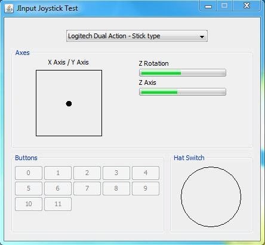

# JInput-Joystick

Test program to see how to use joysticks wtih java.

In the dist foleder you can find compiled program.

Here you can find blog post about it:  
[I'm an inline-style link](https://blog.bozjatorium.com/2013/10/26/joystick-in-java-with-jinput-v2/)
